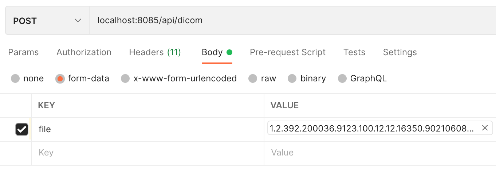
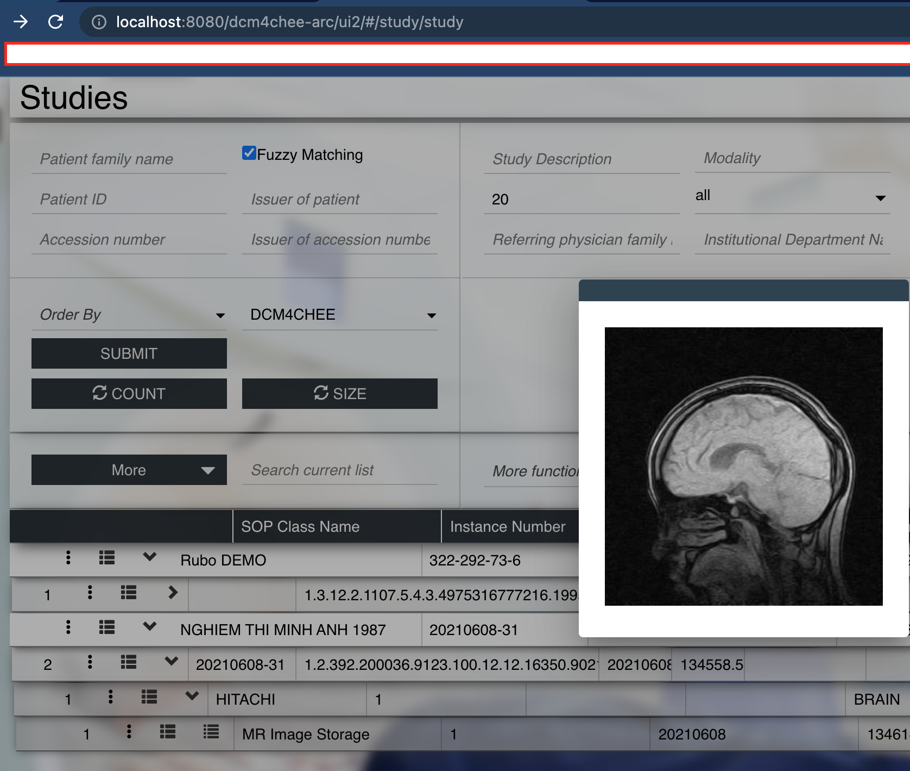

# PREREQUIRE
1.  Dcm4chee archive is running

# UPLOAD DICOM FILE TO DCM4CHEE ARCHIVE 5

## In postman

1.  In headers, set <b>Content-type</b> to <b>multipart/form-data</b>
2.  In body, click form-data and upload DICOM file

## Result
